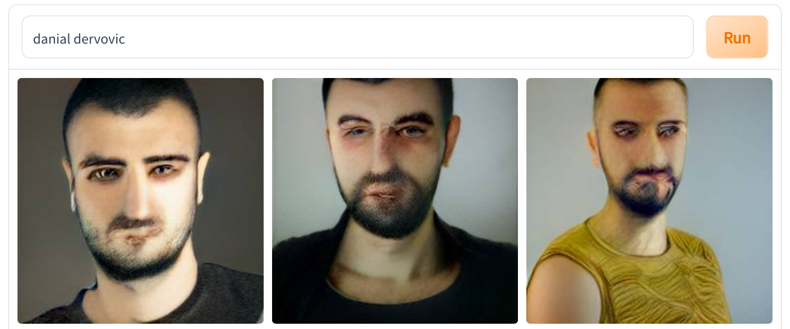

# About
                                   
<!--  -->

Hi, I'm Dan. I work for the [J.P. Morgan AI Research lab](https://www.jpmorgan.com/global/technology/artificial-intelligence) where I work on a mixture of research questions and concrete applications of AI in Finance. 

I earned a PhD from the [UCL Department of Computer Science](http://www.cs.ucl.ac.uk/home/), supervised by [Prof Simone Severini](http://www.ucl.ac.uk/~ucapsse/), embedded in the [CS Quantum](https://quantum.cs.ucl.ac.uk) group. I was in the second cohort of the [EPSRC Centre for Doctoral Training in Delivering Quantum Technologies](www.uclq.org/centre-for-doctoral-training/). Previously, I've worked part-time as a Machine Learning Engineer at [Curvestone](https://www.curvestone.io/) and done an internship in the Data Science team at [Tesco](https://www.tesco.com) working on Operations Research. 

I'm broadly interested in the following topics:

- Sequential Decision Making
- Optimisation (discrete and continuous)
- Explainable AI
- Multi-agent systems and games
- Graph Theory
- Quantum Computation
- Missing Data Problems

Please take a look at the [Papers](papers.md) section of this site and my [Google Scholar page](https://scholar.google.com/citations?user=ttWrIOcAAAAJ&hl=en) if you're interested in publicly available research I've done. I am also on [LinkedIn](https://uk.linkedin.com/in/danial-dervovic). The [Blog](blog.html) has some fun articles, most of which I wrote in 2018. Maybe one day I'll have time to write some more!