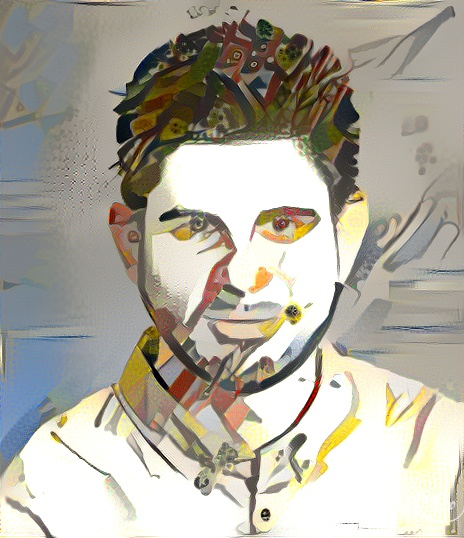

# About
```
.---.               _        .-.  
: .  :             :_;       : :  
: :: : .--.  ,-.,-..-. .--.  : :  
: :; :' .; ; : ,. :: :' .; ; : :_ 
:___.'`.__,_;:_;:_;:_;`.__,_;`.__;
                                  
.---.                               _       
: .  :                             :_;      
: :: : .--. .--. .-..-. .--. .-..-..-. .--. 
: :; :' '_.': ..': `; :' .; :: `; :: :'  ..'
:___.'`.__.':_;  `.__.'`.__.'`.__.':_;`.__.'
```                                                                                                            



Hi, I'm Dan. I'm a PhD student at the [UCL Department of Computer Science](http://www.cs.ucl.ac.uk/home/), supervised by [Prof Simone Severini](http://www.ucl.ac.uk/~ucapsse/), embedded in the [CS Quantum](https://quantum.cs.ucl.ac.uk) group. I am in the second cohort of the [EPSRC Centre for Doctoral Training in Delivering Quantum Technologies](www.uclq.org/centre-for-doctoral-training/).

I'm interested in the following topics:

- Algorithms
- Quantum Computation
- Graph Theory
- Optimisation
- Machine Learning

I really enjoy teaching, lecturing and scientific outreach.


I also program in various languages (check out my [GitHub profile](https://github.com/ddervs)), mainly `python`, `MATLAB` and `C++`. I am the webmaster for my research group's website, [https://quantum.cs.ucl.ac.uk](https://quantum.cs.ucl.ac.uk).
