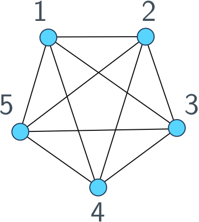

# About

Hi, I'm Dan. I'm a PhD student at the [UCL Department of Computer Science](http://www.cs.ucl.ac.uk/home/), supervised by [Prof Simone Severini](http://www.ucl.ac.uk/~ucapsse/), embedded in the [CS Quantum](https://quantum.cs.ucl.ac.uk) group. I am in the second cohort of the [EPSRC Centre for Doctoral Training in Delivering Quantum Technologies](www.uclq.org/centre-for-doctoral-training/).

I'm interested in the following topics:

- Algorithms
- Quantum Computation
- Graph Theory
- Optimisation
- Machine Learning

I really enjoy teaching, lecturing and scientific outreach.


I also program in various languages (check out my [GitHub profile](https://github.com/ddervs)), mainly `python`, `MATLAB` and `C++`. I am the webmaster for my research group's website, [https://quantum.cs.ucl.ac.uk](https://quantum.cs.ucl.ac.uk).


# Papers

Here are some papers I've written with a high-level overview of what's in them. I've included a [notes](#notes) section at the bottom of the page to help unpack the jargon.

- [Quantum linear systems algorithms: a primer](https://scirate.com/arxiv/1802.08227)
    - *Short summary* This is a review paper (written jointly with Mark Herbster, Peter Mountney, Simone Severini, Naïri Usher and Leonard Wossnig) focusing on algorithms for solving linear systems of equations on a quantum computer. The aim of the paper is to get a resdearcher in the field of classical linear systems solvers up to speed with the quantum algorithms used for this task.

- [For every quantum walk there is a (classical) lifted Markov chain with the same mixing time](https://scirate.com/arxiv/1712.02318)
    - *Short Summary:* Drawing samples from a probability distribution is an important computational task, used in fields such as randomised algorithms and machine learning. Quantum walks are an approach using a quantum computer that aim to speed up this task. In this paper I construct an equivalent classical method, that is, a random walk that mixes in the same number of timesteps, using a technique called _lifting_.
    
    
- [Weak Modular Product of Bipartite Graphs, Bicliques and Isomorphism.](https://scirate.com/arxiv/1707.05179)
    - *Short Summary:* In this joint paper with [Simone Severini](http://www.ucl.ac.uk/~ucapsse/), we resurrect a graph product from the '70s which we use to make an algorithm for the problem of bipartite graph isomorphism. We prove that in certain restricted cases our algorithm is an efficient method for solving this problem.
    

- [Quantum Inspired Algorithms For Graph Matching (Master's Thesis).](https://github.com/ddervs/ddervs.github.io/raw/master/assets/pdfs/GraphKernels.pdf)
    - *Short Summary:* Graph kernels are a method for recognising patterns in data defined as graphs. In this work I define a graph kernel inspired by the theory of quantum walks, that compares favourably with state of the art* methods in graph classification.
    
        <sub style="font-size:60%">\*at the time of writing. This probably isn't true anymore in a field that moves so quickly... 😕</sub>
 
# Blog

- [Is it a banger? Audio classification in tensorflow](https://nbviewer.jupyter.org/github/ddervs/is_it_a_banger/blob/master/scripts/is_it_a_banger.ipynb) In this jupyter notebook, I investigate using a deep neural network to classify audio data as a 'banger' or 'not_a_banger', inspired by _Parks and Recreation_'s [Tom Haverford](https://en.wikipedia.org/wiki/Tom_Haverford).

- [Is it a banger? - Make your own dataset](https://nbviewer.jupyter.org/github/ddervs/is_it_a_banger/blob/master/scripts/load_files.ipynb?flush_cache=true) The companion notebook to [_Is it a banger?_](https://nbviewer.jupyter.org/github/ddervs/is_it_a_banger/blob/master/scripts/is_it_a_banger.ipynb), this shows how to create the dataset used in the article.

# Teaching

I try to involve myself in teaching at UCL as much as I can.

- I demonstrate for the [Principles of Programming course](http://www.cs.ucl.ac.uk/current_students/syllabus_index_2016_2017/undergrad/101p_principles_of_programming/) for the UCL Computer Science Department. This course is a first introduction to programming for undergraduates, using C.

- I demonstrate for the [`MATLAB` course](http://ucl-cs-grad.github.io/matlabgrad/) for the UCL Computer Science Department. This course is designed to help graduate students unfamiliar with programming to be able to carry out and analyse the experiments for their research using `MATLAB`.

- In March 2017, I gave a guest lecture for the Quantum Computation course in the [CDT in Quantum Technologies](www.uclq.org/centre-for-doctoral-training/) on the [*HHL algorithm*](https://en.wikipedia.org/wiki/Quantum_algorithm_for_linear_systems_of_equations). This is a quantum algorithm for solving linear systems of equations that under certain conditions is exponentially faster than any classical method. My typed notes can be found [here](https://github.com/ddervs/ddervs.github.io/raw/master/assets/pdfs/HHL.pdf).

# Outreach

I'm a big fan of communicating science to non-specialists. Here are some of the projects I've been involved with in public engagement.

## Talks

- In February 2018, I gave a talk to year 9 students about careers in science, as part of the [TechGirls](http://www.wearetechgirls.com) Challenge 2017. The talk was a small part of a larger event, in which the students got to experiment with the [IBM Quantum Experience](https://quantumexperience.ng.bluemix.net/qx/experience).

- In February 2017, I gave a talk to a group of A-level students at [Graveney School](http://www.graveney.org) in Tooting, London. The talk was a general introduction to Quantum Computation, titled *The Future of Computing in a Quantum Age*. The slides can be found [here](https://github.com/ddervs/ddervs.github.io/raw/master/assets/pdfs/Graveney_Talk.pdf).


## Quantum Secrets of Photosynthesis

My colleagues in [Alexandra Olaya-Castro's Group](http://www.ucl.ac.uk/~ucapaol/index.html) in the Physics department at UCL have an outreach programme for their research, the [Quantum Secrets of Photosynthesis](http://www.ucl.ac.uk/~ucapaol/outreach.html). They describe what they do most elegantly:
>Our research aims to elucidate fundamental quantum principles underlying energy capture, transfer and conversion at the biomolecular level. 

In the summer of 2016, I volunteered at their exhibit for the [Royal Society Summer Science Exhibition](https://royalsociety.org/science-events-and-lectures/2016/summer-science-exhibition/), where we wowed the public with interactive displays illuminating how plants and bacteria use quantum mechanics to absorb and transfer energy more efficiently than thought possible.

In fact, the exhibition was such a success that it continued on to [Glastonbury Festival](http://glastonburyfestivals.co.uk/) the next year (2017). It was fun.

<html>
<blockquote class="twitter-tweet tw-align-center" data-lang="en-gb"><p lang="en" dir="ltr">&#39;I&#39;ve never had physics explained to me by a topless man with a tinny&#39; <a href="https://twitter.com/hashtag/firsttimeforeverything?src=hash">#firsttimeforeverything</a> <a href="https://twitter.com/hashtag/qsop?src=hash">#qsop</a> <a href="https://twitter.com/hashtag/summerscience?src=hash">#summerscience</a> <a href="https://twitter.com/hashtag/glastonbury2017?src=hash">#glastonbury2017</a></p>&mdash; Quantum Secrets (@quantum_secrets) <a href="https://twitter.com/quantum_secrets/status/877579962651430913">21 June 2017</a></blockquote> <script async src="//platform.twitter.com/widgets.js" charset="utf-8"></script>
</html>

# Notes <a name="notes"></a>

## Graphs

Since I work a lot with graphs and talk about them all the time, let's define what a graph actually is. Here's a picture of a graph.

<center>

</center>

The circles labelled by numbers are called *vertices* and the links between them are called *edges*. We **only** care about the *topology* of the graph, that is, which vertices are connected and which vertices aren't. Where they lie in the plane of our drawing doesn't matter, you can draw a graph however you like as long as the edges respect the connections between vertices.

One way to work with graphs is using an *adjacency list*: a list of each vertex, followed by its neighbours. For example, we would represent the graph above as
```
[[1, [2,3,4,5]],
 [2, [1,3,4,5]],
 [3, [1,2,4,5]],
 [4, [1,2,3,5]],
 [5, [1,2,3,4]]];
```   


## Notes on papers

- [Quantum linear systems algorithms: a primer](https://scirate.com/arxiv/1802.08227)
    - A *linear system of equations* is a collection of two or more linear equations involving the same set of variables. The typical representation for such a system is $A x = b$, where $A$ is a matrix and $x$, $b$ are vectors. $A$ and $b$ are given to us and our job is to find $x$. The solution is $x = A^{-1} b$, where $A^{-1}$ is the *inverse* of $A$. There are many practical issues to computing this inverse matrix, discussed in the paper.

- [For every quantum walk there is a (classical) lifted Markov chain with the same mixing time](https://scirate.com/arxiv/1712.02318)
    - A *Markov chain* is another name for a random walk on a graph. You start at some vertex, then with some predefined probability use move along one of the edges of the graph to an adjacent vertex. Continue this process for some time *T*.
    - A *quantum walk* is the quantum analogue of a discrete-time random walk on a graph. At each timestep a quantum "coin" is flipped and then the walker moves around the vertices of the graph in superposition. After a certain number of timesteps we measure the location of the walker to draw a sample.
    - When a random walk (quantum or classical) has *mixed*, this means that sampling from the distribution is equivalent to sampling from the infinite-time behaviour of the walk. The *mixing time* is how many timesteps it takes to mix.
    - A *lifting* of a Markov chain is a random walk on a larger, "lifted", graph. For each vertex in the original graph we assign at least one vertex in the lifted graph and every vertex in the lifted graph is associated to a vertex in the original graph. There can only be an edge between two vertices in the lifted graph if there is an edge in the original graph between the associated vertices.

- [Weak Modular Product of Bipartite Graphs, Bicliques and Isomorphism.](https://scirate.com/arxiv/1707.05179)
    - A *graph product* is a particular way of combining two graphs to form a larger graph, with edges on the larger graph being present only if certain conditions are satisfied by the edges in the two smaller graphs.
    - A *bipartite graph* is a graph whose vertices can be coloured in such a way that no adjacent vertices have the same colour, using only two colours.
    - *Graph isomorphism* is the problem if determining if two graphs are the same (i.e. have the same edges) up to a relabelling of the vertices. Doing this for bipartite graphs is as hard as for the general case. This is an interesting problem because in practise it's easy, but no one can find a generically 'fast' algorithm or prove that such an algorithm doesn't exist. Usually we know one way or the other. 
    
- [Quantum Inspired Algorithms For Graph Matching (Master's Thesis).](https://github.com/ddervs/ddervs.github.io/raw/master/assets/pdfs/GraphKernels.pdf)
    - A *graph kernel* is a function that takes two graphs and outputs a number that tells you how similar they are. 
    - A *quantum walk* describes the motion of a quantum particle on a graph structure and is used in many quantum algorithms. This work is a classical algorithm using the mathematics describing a quantum walk. 
    - The task of *graph classification* is a machine learning task where we are given a large number of graphs, each with a known label, say `yes` or `no`. Then, given all this data the computer's job is to classify new graphs as `yes`/`no` as quickly and accurately as possible.
