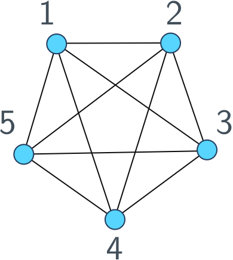

# Notes

## Graphs

Since I work a lot with graphs and talk about them all the time, let's define what a graph actually is. Here's a picture of a graph.

<center>

</center>

The circles labelled by numbers are called *vertices* and the links between them are called *edges*. We **only** care about the *topology* of the graph, that is, which vertices are connected and which vertices aren't. Where they lie in the plane of our drawing doesn't matter, you can draw a graph however you like as long as the edges respect the connections between vertices.

One way to work with graphs is using an *adjacency list*: a list of each vertex, followed by its neighbours. For example, we would represent the graph above as
```
[[1, [2,3,4,5]],
 [2, [1,3,4,5]],
 [3, [1,2,4,5]],
 [4, [1,2,3,5]],
 [5, [1,2,3,4]]];
``` 